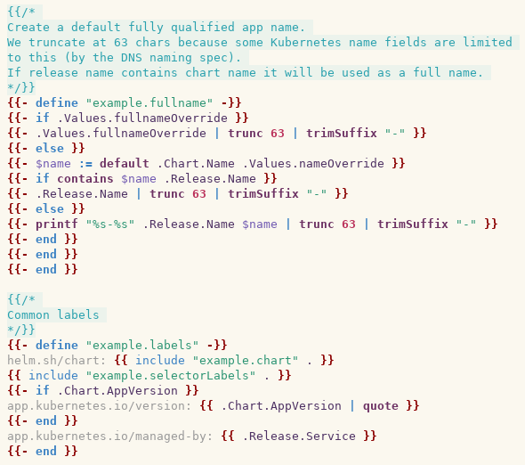

# helm-template-mode - Helm template highlighter for Emacs



## Installation

Copy `helm-template-mode.el` into `~/.emacs.d/local/helm-template-mode` and
put the following into your `.emacs` config:

```lisp
(add-to-list 'load-path "~/.emacs.d/local/helm-template-mode/")
(require 'helm-template-mode)

(add-to-list 'auto-mode-alist '("/templates/.+\\.yaml\\'" . helm-template-mode))
(add-to-list 'auto-mode-alist '("/templates/.+\\.tpl\\'" . helm-template-mode))
```
